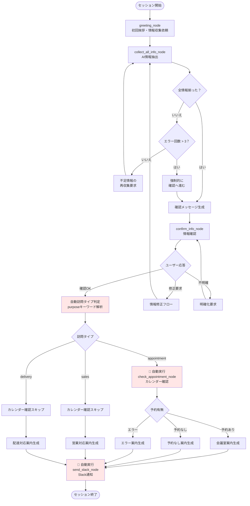
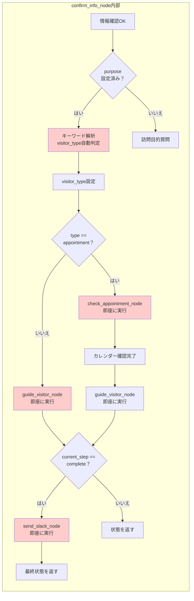
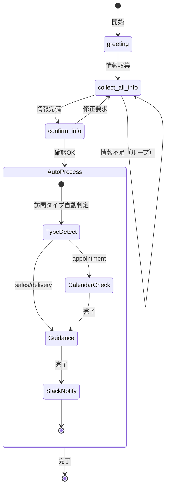

# AI受付システム - 実装フロー分析ドキュメント

## 📋 概要

このドキュメントは、AI受付システムの**実際のコード実装**に基づくフロー図と動作説明です。  
READMEに記載された設計フローと実装の差異も明記しています。

生成日: 2025-08-07

## 🔍 実装ファイル

- `backend/app/agents/nodes.py` - ノード実装
- `backend/app/agents/reception_graph.py` - グラフ定義とフロー制御

## 📊 実装フロー図（詳細版）



## 🚀 自動実行される処理の詳細

### 1. confirm_info_node内の自動処理チェーン



## 📝 訪問タイプ判定ロジック

### キーワードマッピング（nodes.py 346-355行目）

| 訪問タイプ | 判定キーワード | 処理フロー |
|------------|---------------|------------|
| **appointment** | 予約, 会議, 打ち合わせ, アポ, appointment, ミーティング | カレンダー確認 → 案内 → Slack |
| **sales** | 営業, 商談, 提案, sales, セールス | 案内 → Slack |
| **delivery** | 配達, 荷物, 宅配, delivery, 配送 | 案内 → Slack |
| **デフォルト** | 上記以外すべて | appointment扱い（カレンダー確認実行） |

## ⚠️ 実装上の問題点

### 1. 過度な自動実行

**問題箇所**: `confirm_info_node` (nodes.py 362-406行目)

```python
# 問題のコード構造
if visitor_type == "appointment":
    # カレンダー確認を自動実行
    calendar_result = await self.check_appointment_node(updated_state)
    # その後、案内も自動実行
    guidance_result = await self.guide_visitor_node(calendar_result)
    # さらにSlack通知も自動実行
    slack_result = await self.send_slack_node(guidance_result)
    return slack_result
```

**影響**:
- ユーザーが「はい」と確認しただけで、全処理が一気に完了
- 中間での確認や修正機会なし
- エラー時の回復が困難

### 2. 誤った自動処理の可能性

**シナリオ例**:
1. 配達業者が「荷物の配達で来ました」と言う
2. システムが正しく`delivery`と判定
3. しかし、デフォルト処理でカレンダー確認が実行される場合がある

### 3. process_visitor_type_nodeの到達不可能性

**問題**: 
- `confirm_info_node`で訪問タイプを自動判定し、即座に後続処理を実行
- `process_visitor_type_node`は実際には呼ばれない
- `reception_graph.py`のルーティングが機能していない

## 🔄 実際の処理フロー（簡略版）



## 💡 改善提案

### 1. 段階的な確認フロー
- 各処理段階でユーザー確認を挟む
- 自動実行を減らし、対話的な処理に変更

### 2. 明確な訪問タイプ選択
- purposeからの自動判定に頼らず、明示的な選択を促す
- 判定後の確認ステップを追加

### 3. エラーリカバリーの強化
- 各段階でのキャンセル・修正機能
- タイムアウト処理の追加

## 📌 まとめ

現在の実装は、**確認完了後にすべての処理が自動実行される**設計になっています。これにより：

✅ **メリット**:
- 高速な処理完了
- 最小限のユーザー入力
- シームレスな体験

❌ **デメリット**:
- 誤判定時の修正困難
- 配達・営業でも不要なカレンダー確認の可能性
- ユーザーコントロールの欠如

設計図（README）と実装の主な相違点は、**自動実行の範囲**と**訪問タイプ判定の処理位置**にあります。