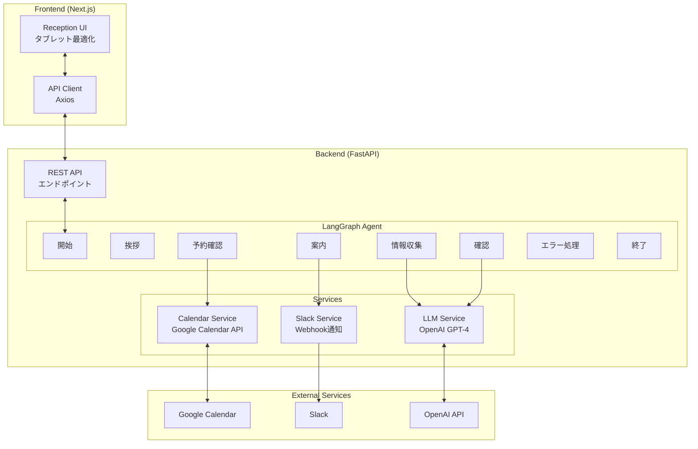
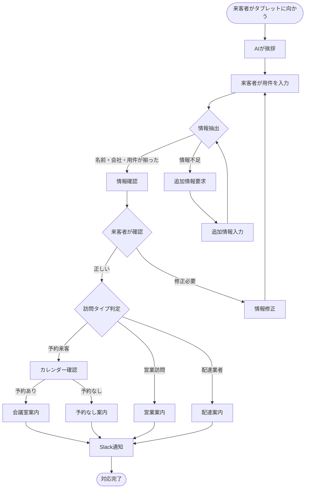
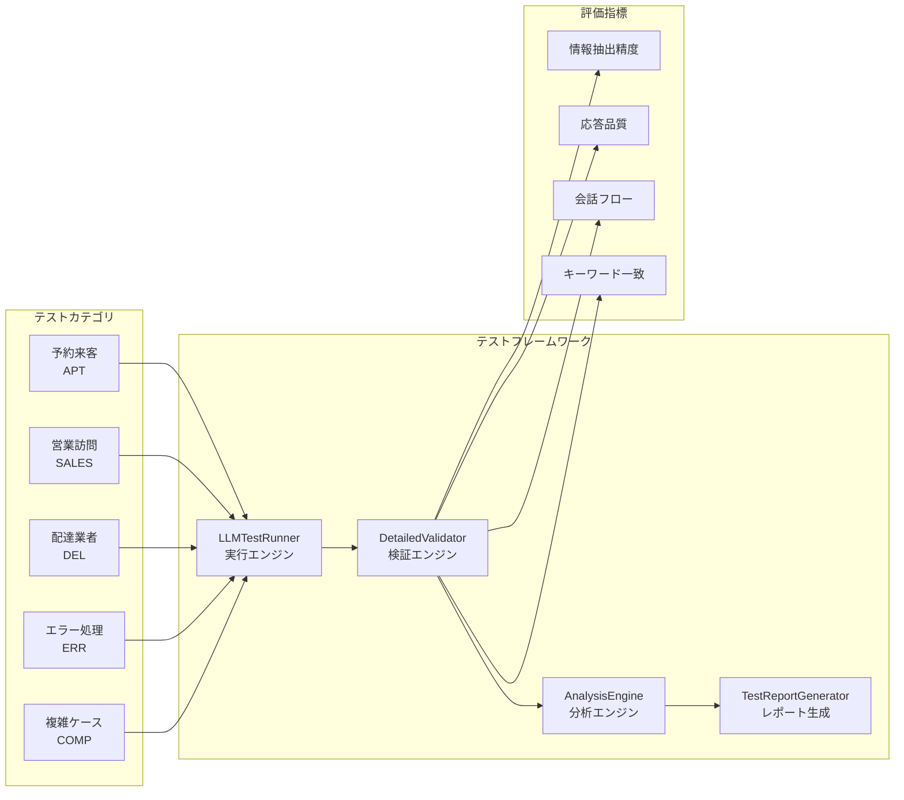
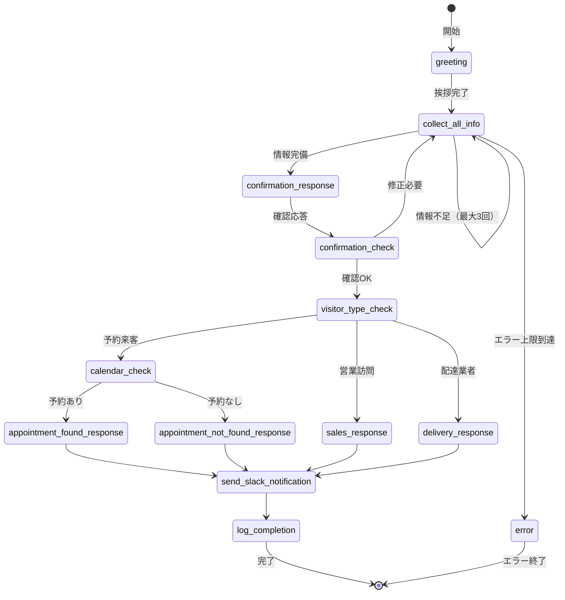

# AI受付システム - Text-based Reception System

タブレット型AI受付システムのStep1実装。LangGraph + FastAPI + NextJSを使用したテキストベースの来客対応システム。

> **Step1完了**: テキスト対応システム | **Step2予定**: 音声機能拡張対応

## 🚀 クイックスタート（開発環境）

### 前提条件

- **Python 3.11+** (仮想環境を使用)
- **Node.js 18+** 
- **npm**
- **OpenAI API Key**
- **Google Service Account Key** (Calendar API用)
- **Slack Webhook URL**

> **推奨**: Pythonパッケージのグローバルインストールを避けるため、仮想環境の使用を強く推奨します。

### 1. リポジトリのクローンとPython仮想環境のセットアップ

```bash
# リポジトリをクローン
git clone <repository-url>
cd ai-reception

# Python仮想環境の作成
python -m venv venv

# 仮想環境のアクティベート
# Windows:
venv\Scripts\activate
# Mac/Linux:
source venv/bin/activate

# pip のアップグレード（推奨）
python -m pip install --upgrade pip

# バックエンド依存関係のインストール（仮想環境内で実行）
pip install -r backend/requirements.txt

# フロントエンド依存関係のインストール
cd frontend && npm install
cd ..
```

### 2. 環境変数の設定

```bash
# バックエンド環境変数設定
cp backend/.env.example backend/.env

# .envファイルを編集して以下を設定:
# OPENAI_API_KEY=sk-your-openai-api-key
# GOOGLE_SERVICE_ACCOUNT_KEY={"type":"service_account",...}
# SLACK_WEBHOOK_URL=https://hooks.slack.com/services/...
# MEETING_ROOM_CALENDAR_IDS=calendar1@group.calendar.google.com,calendar2@group.calendar.google.com
```

### 3. Google Calendar設定

1. [Google Cloud Console](https://console.cloud.google.com/)でプロジェクト作成
2. Calendar APIを有効化
3. サービスアカウントを作成してJSONキーをダウンロード
4. 会議室カレンダーをサービスアカウントと共有
5. JSONキーの内容を`GOOGLE_SERVICE_ACCOUNT_KEY`環境変数に設定

### 4. Slack設定

1. [Slack App](https://api.slack.com/apps)を作成
2. Incoming Webhookを追加
3. Webhook URLを`SLACK_WEBHOOK_URL`環境変数に設定

### 5. 開発サーバーの起動

> **注意**: 以下のコマンドは仮想環境がアクティブな状態で実行してください。  
> 仮想環境がアクティブでない場合は `source venv/bin/activate` (Mac/Linux) または `venv\Scripts\activate` (Windows) を実行してください。

#### バックエンド (FastAPI)

```bash
# 仮想環境がアクティブであることを確認
which python  # Mac/Linux
where python  # Windows

# 開発用サーバー起動 (ポート8000)
cd backend
python -m uvicorn app.main:app --reload --port 8000

# または直接実行
python app/main.py
```

**API確認**: http://localhost:8000/api/health

#### フロントエンド (NextJS)

```bash
# 新しいターミナルを開いて実行（仮想環境は不要）
cd frontend
npm run dev
```

**アプリケーション確認**: http://localhost:3000

### 6. 動作確認

1. **ホームページ**: http://localhost:3000
2. **受付画面**: http://localhost:3000/reception
3. **API健康チェック**: http://localhost:8000/api/health
4. **API文書** (開発時のみ): http://localhost:8000/docs

## 📁 プロジェクト構造

```
ai-reception/
├── README.md                          # プロジェクトドキュメント
├── context-engineering/               # 開発ドキュメント・設計資料
│   ├── CLAUDE.md                     # Claude AIコンテキスト
│   ├── LLM_TEST_PLAN.md              # LLMテスト計画
│   ├── TEST_SCENARIOS.yaml           # テストシナリオ定義
│   └── PRPs/                         # プロジェクト要件文書
│       ├── ai-reception-system.md
│       ├── step1-text-reception-system.md
│       └── step2-voice-enhancement.md
├── backend/                          # FastAPI バックエンド
│   ├── app/
│   │   ├── main.py                  # FastAPI アプリケーション
│   │   ├── config.py                # 環境設定
│   │   ├── models/                  # データモデル (Pydantic/TypedDict)
│   │   │   ├── conversation.py      # 会話モデル
│   │   │   └── visitor.py           # 訪問者モデル
│   │   ├── agents/                  # LangGraph エージェント
│   │   │   ├── nodes.py             # ノード定義
│   │   │   └── reception_graph.py   # 受付フローグラフ
│   │   ├── services/                # 外部サービス統合
│   │   │   ├── calendar_service.py  # Google Calendar統合
│   │   │   ├── slack_service.py     # Slack通知
│   │   │   └── text_service.py      # LLM処理
│   │   └── api/                     # REST API エンドポイント
│   │       └── conversation.py      # 会話API
│   ├── tests/                       # テストスイート
│   │   ├── README_LLM_TESTING.md    # LLMテストガイド
│   │   ├── test_llm_integration.py  # LLM統合テスト
│   │   ├── llm_test_framework.py    # テストフレームワーク
│   │   ├── llm_test_runner.py       # テスト実行エンジン
│   │   ├── test_scenarios.yaml      # テストシナリオ定義
│   │   ├── test_reception_graph.py  # グラフテスト
│   │   ├── test_calendar_service.py # カレンダーテスト
│   │   └── test_conversation_api.py # APIテスト
│   ├── requirements.txt             # Python 依存関係
│   ├── pyproject.toml               # Python プロジェクト設定
│   └── .env.example                 # 環境変数テンプレート
├── frontend/                        # NextJS フロントエンド
│   ├── app/                         # App Router ディレクトリ
│   │   ├── layout.tsx               # ルートレイアウト
│   │   ├── page.tsx                 # ホームページ
│   │   ├── globals.css              # グローバルスタイル
│   │   └── reception/               # 受付ページ
│   │       └── page.tsx
│   ├── components/                  # React コンポーネント
│   │   ├── ChatInterface.tsx        # チャットUI
│   │   ├── ConversationDisplay.tsx  # 会話表示
│   │   └── ReceptionButton.tsx      # 受付ボタン
│   ├── lib/                         # ユーティリティ・API クライアント
│   │   ├── api.ts                   # APIクライアント
│   │   └── types.ts                 # TypeScript型定義
│   ├── package.json                 # Node.js 依存関係
│   ├── tailwind.config.js           # Tailwind CSS設定
│   └── tsconfig.json                # TypeScript設定
├── venv/                            # Python仮想環境（.gitignoreに追加）
└── vercel.json                      # Vercel デプロイ設定
```

## 🔧 開発ワークフロー

### テスト実行

> **注意**: Python関連のコマンドは仮想環境がアクティブな状態で実行してください。

```bash
# バックエンドテスト（仮想環境内で実行）
cd backend
pytest tests/ -v

# フロントエンドテスト（新しいターミナルで実行）
cd frontend  
npm test

# 型チェック
npm run type-check
```

### コード品質チェック

```bash
# Python (Ruff) - 仮想環境内で実行
cd backend
ruff check app/ --fix
ruff format app/

# TypeScript/JavaScript (ESLint)
cd frontend
npm run lint
```

### ビルド確認

```bash
# バックエンド起動確認（仮想環境内で実行）
cd backend
python app/main.py

# フロントエンドビルド
cd frontend
npm run build
```

## 🎯 機能概要

### コア機能

1. **🤖 AI対話システム**
   - LangGraphによる会話フロー管理
   - 自然言語での来客者情報収集
   - 確認・修正フロー

2. **📅 予約確認システム**
   - Google Calendar API統合
   - 複数会議室対応
   - 来客者名での自動マッチング

3. **🎯 来客者タイプ判定**
   - 予約来客 (appointment)
   - 営業訪問 (sales)  
   - 配達業者 (delivery)

4. **💬 Slack通知**
   - リッチメッセージ形式
   - 対応ログ自動送信
   - エラー通知

5. **📱 タブレット最適化UI**
   - レスポンシブデザイン
   - タッチフレンドリー
   - リアルタイム会話表示

### API エンドポイント

| メソッド | エンドポイント | 説明 |
|---------|-------------|-----|
| `GET` | `/api/health` | システム健康チェック |
| `POST` | `/api/conversations` | 新しい会話開始 |
| `POST` | `/api/conversations/{id}/messages` | メッセージ送信 |
| `GET` | `/api/conversations/{id}` | 会話履歴取得 |
| `DELETE` | `/api/conversations/{id}` | 会話終了 |

## 🔄 Step2拡張対応設計

現在の実装は**Step2: 音声機能拡張**に対応するよう設計されています：

```python
# 拡張ポイント1: MessageProcessor Protocol
class AudioService(MessageProcessor):
    async def process_input(self, audio_data: bytes) -> str:
        # Whisper API: 音声 → テキスト
        
    async def generate_output(self, text: str) -> bytes:
        # TTS API: テキスト → 音声

# 拡張ポイント2: WebSocket対応
# REST API → WebSocket API (リアルタイム音声通信)

# 拡張ポイント3: UI拡張
# テキストチャット → 音声インターフェース
```

## 🚀 本番デプロイ

### Vercel デプロイ

1. **環境変数設定**
   ```bash
   # Vercel環境変数として設定
   - OPENAI_API_KEY
   - GOOGLE_SERVICE_ACCOUNT_KEY  
   - SLACK_WEBHOOK_URL
   - MEETING_ROOM_CALENDAR_IDS
   ```

2. **デプロイ実行**
   ```bash
   # Vercel CLI使用
   npm i -g vercel
   vercel

   # または GitHub連携でCD設定
   ```

### 手動デプロイ

```bash
# フロントエンドビルド
cd frontend && npm run build

# バックエンド起動 (例: Docker)
cd backend
pip install -r requirements.txt
uvicorn app.main:app --host 0.0.0.0 --port 8000
```

## 🐛 トラブルシューティング

### よくある問題

**1. Google Calendar API エラー**
```bash
# サービスアカウント権限確認
# カレンダー共有設定確認
# GOOGLE_SERVICE_ACCOUNT_KEY形式確認 (JSON文字列)
```

**2. OpenAI API エラー**
```bash
# API キーの確認
# クォータ・請求設定確認
```

**3. フロントエンドビルドエラー**
```bash
# Node.js バージョン確認 (18+ 必要)
# npm install 再実行
# package-lock.json 削除後再インストール
```

**4. Python依存関係エラー**
```bash
# 仮想環境がアクティブか確認
which python  # /path/to/ai-reception/venv/bin/python が表示されるべき

# 仮想環境をアクティベート
source venv/bin/activate  # Mac/Linux
venv\Scripts\activate     # Windows

# Python バージョン確認 (3.11+ 推奨)
python --version

# pip のアップグレード
python -m pip install --upgrade pip

# 依存関係の再インストール
pip install -r backend/requirements.txt --no-cache-dir
```

### ログ確認

```bash
# バックエンドログ（仮想環境内で実行）
cd backend && python app/main.py
# コンソール出力でエラー確認

# フロントエンドログ  
cd frontend && npm run dev
# ブラウザ Developer Tools で確認
```

## 🔄 システムアーキテクチャ

### 全体構成図



### ユーザーフロー図



## 🧪 LLMテストフレームワーク

### テスト概要

AI受付システムの品質を保証するための包括的なLLMテストフレームワークを実装しています。



### テスト実行方法

```bash
# 仮想環境をアクティベート
source venv/bin/activate  # Mac/Linux
venv\Scripts\activate     # Windows

# 特定カテゴリのテスト
cd backend
pytest tests/test_llm_integration.py::TestLLMIntegration::test_appointment_scenarios -v

# 全体テスト実行
pytest tests/test_llm_integration.py -v

# 詳細レポート生成
pytest tests/test_llm_integration.py --llm-report
```

### テストシナリオ

| カテゴリ | シナリオID | 説明 | 成功率基準 |
|---------|-----------|------|-----------|
| **APT** | APT-001 | 標準的な予約来客 | 65%以上 |
| | APT-002 | 時間指定なしの予約 | |
| | APT-003 | 予約が見つからない | |
| **SALES** | SALES-001 | 標準的な営業訪問 | 33%以上 |
| | SALES-002 | 商品紹介での営業 | |
| | SALES-003 | 曖昧な営業表現 | |
| **DEL** | DEL-001 | 標準的な配達 | 50%以上 |
| | DEL-002 | 個人名なしの配達 | |
| **ERR** | ERR-001 | 情報不足エラー | 33%以上 |
| | ERR-002 | 情報訂正フロー | |
| | ERR-003 | 部分的な情報提供 | |
| **COMP** | COMP-001 | 複数の用件 | 50%以上 |
| | COMP-002 | 敬語なしの来客 | |
| | COMP-003 | 長い説明の来客 | |

### 評価メトリクス

- **情報抽出精度**: 名前、会社名、訪問タイプの正確な抽出
- **応答品質**: 丁寧さ、明確さ、適切性
- **会話フロー**: 状態遷移の正確性
- **キーワード一致**: 必須キーワードの含有（柔軟なマッチング対応）

## 📖 開発者向け情報

### アーキテクチャ決定

- **LangGraph**: 会話フロー管理
- **FastAPI**: 高性能非同期API
- **NextJS 15**: モダンReactフレームワーク
- **TypeScript**: 型安全性
- **Tailwind CSS**: ユーティリティファーストCSS

### LangGraphフロー詳細



### 拡張ガイド

**新しいノード追加**:
```python
# backend/app/agents/nodes.py に追加
async def new_node(self, state: ConversationState) -> ConversationState:
    # ノード処理ロジック
    return updated_state
```

**新しいAPI追加**:
```python  
# backend/app/api/ に新しいルーターファイル作成
# main.py で include_router
```

**新しいコンポーネント追加**:
```tsx
// frontend/components/ に新しいコンポーネント作成
// TypeScript + Tailwind CSS使用
```

## 📞 サポート

- **Issue報告**: GitHubリポジトリのIssue機能
- **機能要望**: PRsまたはIssue 
- **技術質問**: 開発者ドキュメント参照

---

## 📜 ライセンス

MIT License - 詳細は`LICENSE`ファイルを参照

---

**AI Reception System v1.0.0 - Step1: Text-based Reception Complete ✅**