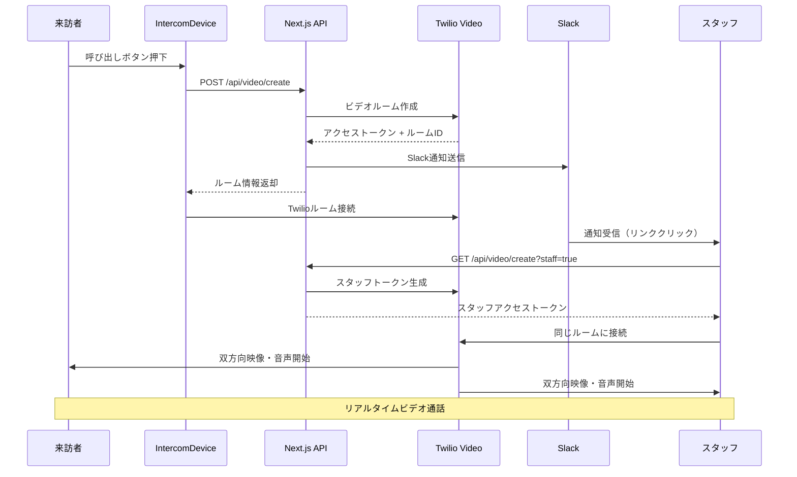

# 🔔 Simple Intercom System

シンプルなタブレット型インターコムシステム。Twilio Video APIを使用したワンクリックビデオ通話システム。

## 🚀 クイックスタート

### 前提条件

- **Node.js 18+** 
- **npm**
- **Twilio Video API**（ビデオ通話機能用）
- **Slack Webhook URL**（通知用）
- **Google Calendar API**（カレンダー機能用）

### 🏃‍♂️ 簡単スタート

```bash
# 1. リポジトリをクローン
git clone <repository-url>
cd ai-reception/frontend

# 2. 依存関係をインストール
npm install

# 3. 環境変数を設定
cp .env.example .env.local
# .env.localファイルを編集してAPI キーを設定

# 4. デュアル開発サーバー起動（推奨）
npm run dev:dual
```

**起動確認:**
- 👥 来訪者用（インターコム端末）: http://localhost:3000
- 👨‍💼 スタッフ用（応答側）: http://localhost:3001
- 📚 各種API: Next.js APIルート

> **注意**: 開発環境では来訪者用(3000)とスタッフ用(3001)の2つのサーバーが同時起動します。これにより単体でビデオ通話テストが可能になります。

### 🎥 インターコム使用方法

1. **来訪者側**: http://localhost:3000 でインターコム画面を表示
   - 中央の呼び出しボタンを押すだけで通話開始
   - 自動的にTwilioビデオルームを作成
   - Slackに通知を送信

2. **スタッフ側**: Slack通知のリンクをクリック
   - http://localhost:3001のスタッフ用画面に自動接続
   - 同じビデオルームに参加

3. **双方向通話**: 両者で映像・音声通話を実施

## 🛠️ 利用可能なコマンド

```bash
# デュアル開発サーバー（推奨）
npm run dev:dual        # 来訪者(3000) + スタッフ(3001)同時起動

# 個別開発サーバー
npm run dev:visitor     # 来訪者用のみ（ポート3000）
npm run dev:staff       # スタッフ用のみ（ポート3001）

# ビルド・テスト
npm run build           # プロダクションビルド
npm run lint            # ESLint実行
npm run type-check      # TypeScript型チェック
```

## 📁 プロジェクト構造

```
frontend/
├── README.md                          # このファイル
├── app/                               # Next.js App Router
│   ├── layout.tsx                     # ルートレイアウト
│   ├── page.tsx                       # ホームページ（インターコム）
│   ├── video-call/                    # ビデオ通話ページ
│   └── api/                           # API Routes
│       ├── video/create/              # ビデオルーム作成API
│       └── slack/notify/              # Slack通知API
├── components/                        # React コンポーネント
│   ├── IntercomDevice.tsx             # メインインターコム端末UI
│   ├── VideoMonitor.tsx               # ビデオ表示モニター
│   ├── CallButton.tsx                 # 通話ボタン
│   ├── VideoCallInterface.tsx         # ビデオ通話インターフェース
│   └── ui/                            # UI基盤コンポーネント
│       ├── card.tsx
│       ├── button.tsx
│       └── index.ts
├── stores/                            # Zustand状態管理
│   ├── useIntercomStore.ts            # インターコム状態
│   └── useReceptionStore.ts           # 受付システム状態
├── lib/                               # ユーティリティ・サービス
│   ├── api.ts                         # APIクライアント
│   └── services/                      # 各種サービス
│       ├── twilio.ts                  # Twilio Video統合
│       ├── intercom-api.ts            # インターコムAPI
│       └── slack.ts                   # Slack通知
├── package.json                       # 依存関係・スクリプト
├── tailwind.config.js                 # Tailwind CSS設定
├── tsconfig.json                      # TypeScript設定
├── next.config.js                     # Next.js設定
└── .env.example                       # 環境変数テンプレート
```

## 🔧 システムアーキテクチャ

### 全体構成図

```mermaid
graph TB
    subgraph "Frontend (Next.js 15)"
        Visitor[来訪者側<br/>IntercomDevice<br/>ポート3000]
        Staff[スタッフ側<br/>VideoCallInterface<br/>ポート3001]
    end
    
    subgraph "Next.js API Routes"
        CreateVideo[/api/video/create<br/>Twilioルーム作成]
        SlackNotify[/api/slack/notify<br/>Slack通知]
    end
    
    subgraph "External Services"
        Twilio[Twilio Video API<br/>リアルタイム通話]
        Slack[Slack Webhook<br/>スタッフ通知]
        Calendar[Google Calendar<br/>予定確認]
    end
    
    Visitor --> CreateVideo
    CreateVideo --> Twilio
    CreateVideo --> SlackNotify
    SlackNotify --> Slack
    Staff --> Twilio
    
    style Visitor fill:#e3f2fd,stroke:#1976d2,stroke-width:2px
    style Staff fill:#f3e5f5,stroke:#7b1fa2,stroke-width:2px
    style Twilio fill:#fff3e0,stroke:#f57c00,stroke-width:3px
```

### インターコムフロー



## ⚙️ 設定

### 環境変数設定

`.env.local`ファイルを作成し、以下の値を設定：

```bash
# Application Environment
NODE_ENV=development
FRONTEND_URL=http://localhost:3000

# Development Configuration (for dual server mode)
STAFF_PORT=3001

# Twilio Video Configuration (Required)
TWILIO_ACCOUNT_SID=your_twilio_account_sid
TWILIO_AUTH_TOKEN=your_twilio_auth_token
TWILIO_API_KEY=your_twilio_api_key
TWILIO_API_SECRET=your_twilio_api_secret

# Slack Configuration (Required)
SLACK_BOT_TOKEN=your_slack_bot_token
SLACK_CHANNEL=#your-channel

# Google Calendar Configuration (Optional)
GOOGLE_SERVICE_ACCOUNT_KEY={"type":"service_account",...}
MEETING_ROOM_CALENDAR_IDS=calendar@example.com

# Session Configuration
SESSION_TIMEOUT_MINUTES=30
MAX_CORRECTION_ATTEMPTS=3
```

### Twilio Video設定

1. [Twilio Console](https://console.twilio.com/)でアカウント作成
2. Video APIを有効化
3. API KeyとSecretを生成
4. 環境変数に設定

### Slack設定

1. [Slack App](https://api.slack.com/apps)を作成
2. Bot tokenを生成
3. 通知チャンネルを指定
4. 環境変数に設定

## 🎯 機能概要

### コア機能

1. **📞 ワンクリック通話**
   - 来訪者側：大きな呼び出しボタン1つ
   - 自動的にTwilioビデオルーム作成
   - スタッフへの即座のSlack通知

2. **🎥 双方向ビデオ通話**
   - リアルタイム映像・音声通信
   - Twilio Video SDK使用
   - ブラウザベースの通話（アプリ不要）

3. **📱 インターコム端末UI**
   - タブレット最適化デザイン
   - レトロなインターコム風デザイン
   - 状態表示（待機中・呼び出し中・接続中）

4. **👥 デュアルサーバー開発環境**
   - 来訪者用(3000)とスタッフ用(3001)の同時起動
   - 1台のPCで完全なテストが可能

5. **🔔 Slack通知システム**
   - 来訪者の呼び出し時に自動通知
   - スタッフ用接続リンクを自動生成
   - 通話状況をリアルタイム共有

### API エンドポイント

| メソッド | エンドポイント | 説明 |
|---------|-------------|-----|
| `POST` | `/api/video/create` | 新しいビデオルーム作成 |
| `GET` | `/api/video/create?staff=true` | スタッフ用トークン生成 |
| `POST` | `/api/slack/notify` | Slack通知送信 |

## 🔧 開発ワークフロー

### テスト実行

```bash
# 型チェック
npm run type-check

# Lint
npm run lint

# ビルド確認
npm run build
```

### デバッグ

ブラウザのDeveloper Toolsコンソールで以下のログを確認：

- `🎥 Video elements before/after connection` - ビデオ要素の状態
- `🔊 Audio track attached successfully` - 音声トラック接続
- `✅ Connected to Twilio room` - Twilio接続状況

## 🐛 トラブルシューティング

### よくある問題

**1. ビデオ・音声が表示されない**
```bash
# ブラウザでマイク・カメラ許可を確認
# Developer Toolsでエラーログを確認
# Twilio接続ログを確認
```

**2. Slack通知が届かない**
```bash
# SLACK_BOT_TOKEN の確認
# チャンネル権限の確認
# Webhook URLの確認
```

**3. ポート競合エラー**
```bash
# プロセス確認
lsof -i :3000 -i :3001

# プロセス終了
kill -9 <PID>
```

**4. Twilioトークンエラー**
```bash
# 環境変数の確認
# API Key/Secret の確認
# Account SIDの確認
```

## 📝 更新履歴

### v2.0.0 (2025-09-04)
- 🏗️ **システム全体を大幅リファクタリング**
  - AIチャットシステムからシンプルインターコムシステムへ変更
  - Twilio Video APIベースのリアルタイムビデオ通話実装
  - インターコム端末風UIデザイン
- ✅ **機能改善**
  - ワンクリック通話開始
  - 双方向映像・音声通話
  - デュアル開発サーバー対応
  - Slack通知統合

### 技術仕様

- **フロントエンド**: Next.js 15 + TypeScript + Tailwind CSS
- **状態管理**: Zustand
- **ビデオ通話**: Twilio Video API
- **通知**: Slack Webhooks
- **デプロイ**: Vercel対応

---

**Simple Intercom System v2.0.0 - Twilio Video Integration ✅**

### 🎉 主要機能

- **📞 ワンクリック通話**: 大きなボタン1つで即座に通話開始
- **🎥 双方向ビデオ**: リアルタイム映像・音声通信
- **📱 インターコム端末**: タブレット最適化されたレトロデザイン
- **🔔 Slack通知**: 自動スタッフ通知とリンク生成
- **👥 デュアル開発**: 1台のPCで完全テスト可能