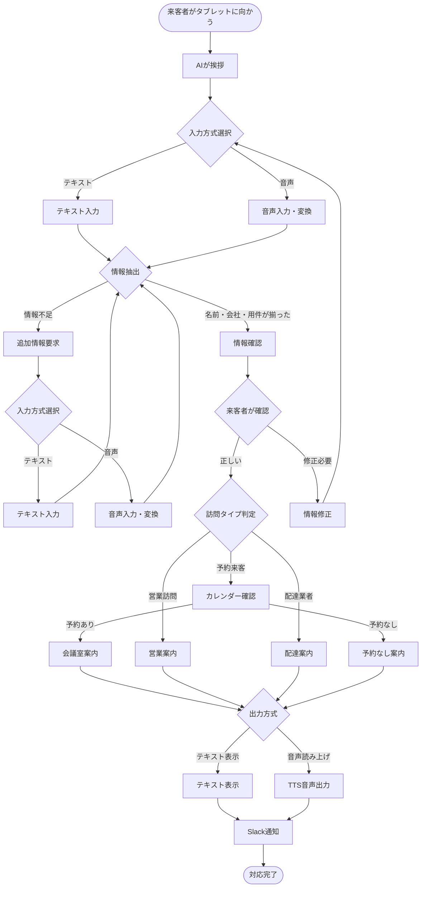

# AI受付システム - Hybrid Reception System

タブレット型AI受付システムのStep1実装。LangGraph + FastAPI + NextJSを使用したテキスト・音声対応来客システム。

> **Step1完了**: テキスト・音声対応システム | **Step2予定**: 高度な音声機能拡張

## 🚀 クイックスタート（開発環境）

### 前提条件

- **Python 3.11+** (仮想環境を使用)
- **Node.js 18+** 
- **npm**
- **OpenAI API Key**
- **Google Service Account Key** (Calendar API用)
- **Slack Webhook URL**

> **推奨**: Pythonパッケージのグローバルインストールを避けるため、仮想環境の使用を強く推奨します。

### 1. リポジトリのクローンとPython仮想環境のセットアップ

```bash
# リポジトリをクローン
git clone <repository-url>
cd ai-reception

# Python仮想環境の作成
python -m venv venv

# 仮想環境のアクティベート
# Windows:
venv\Scripts\activate
# Mac/Linux:
source venv/bin/activate

# pip のアップグレード（推奨）
python -m pip install --upgrade pip

# バックエンド依存関係のインストール（仮想環境内で実行）
pip install -r backend/requirements.txt

# フロントエンド依存関係のインストール
cd frontend && npm install
cd ..
```

### 2. 環境変数の設定

```bash
# バックエンド環境変数設定
cp backend/.env.example backend/.env

# .envファイルを編集して以下を設定:
# OPENAI_API_KEY=sk-your-openai-api-key
# GOOGLE_SERVICE_ACCOUNT_KEY={"type":"service_account",...}
# SLACK_WEBHOOK_URL=https://hooks.slack.com/services/...
# MEETING_ROOM_CALENDAR_IDS=calendar1@group.calendar.google.com,calendar2@group.calendar.google.com
```

### 3. Google Calendar設定

1. [Google Cloud Console](https://console.cloud.google.com/)でプロジェクト作成
2. Calendar APIを有効化
3. サービスアカウントを作成してJSONキーをダウンロード
4. 会議室カレンダーをサービスアカウントと共有
5. JSONキーの内容を`GOOGLE_SERVICE_ACCOUNT_KEY`環境変数に設定

### 4. Slack設定

1. [Slack App](https://api.slack.com/apps)を作成
2. Incoming Webhookを追加
3. Webhook URLを`SLACK_WEBHOOK_URL`環境変数に設定

### 5. 開発サーバーの起動

> **注意**: 以下のコマンドは仮想環境がアクティブな状態で実行してください。  
> 仮想環境がアクティブでない場合は `source venv/bin/activate` (Mac/Linux) または `venv\Scripts\activate` (Windows) を実行してください。

#### バックエンド (FastAPI)

```bash
# 仮想環境がアクティブであることを確認
which python  # Mac/Linux
where python  # Windows

# 開発用サーバー起動 (ポート8000)
cd backend
python -m uvicorn app.main:app --reload --port 8000

# または直接実行
python app/main.py
```

**API確認**: http://localhost:8000/api/health

#### フロントエンド (NextJS)

```bash
# 新しいターミナルを開いて実行（仮想環境は不要）
cd frontend
npm run dev
```

**アプリケーション確認**: http://localhost:3000

### 6. 動作確認

1. **ホームページ**: http://localhost:3000
2. **受付画面**: http://localhost:3000/reception
3. **API健康チェック**: http://localhost:8000/api/health
4. **API文書** (開発時のみ): http://localhost:8000/docs

## 📁 プロジェクト構造

```
ai-reception/
├── README.md                          # プロジェクトドキュメント
├── context-engineering/               # 開発ドキュメント・設計資料
│   ├── CLAUDE.md                     # Claude AIコンテキスト
│   ├── LLM_TEST_PLAN.md              # LLMテスト計画
│   ├── TEST_SCENARIOS.yaml           # テストシナリオ定義
│   └── PRPs/                         # プロジェクト要件文書
│       ├── ai-reception-system.md
│       ├── step1-text-reception-system.md
│       └── step2-voice-enhancement.md
├── backend/                          # FastAPI バックエンド
│   ├── app/
│   │   ├── main.py                  # FastAPI アプリケーション
│   │   ├── config.py                # 環境設定
│   │   ├── models/                  # データモデル (Pydantic/TypedDict)
│   │   │   ├── conversation.py      # 会話モデル
│   │   │   └── visitor.py           # 訪問者モデル
│   │   ├── agents/                  # LangGraph エージェント
│   │   │   ├── nodes.py             # ノード定義
│   │   │   └── reception_graph.py   # 受付フローグラフ
│   │   ├── services/                # 外部サービス統合
│   │   │   ├── calendar_service.py  # Google Calendar統合
│   │   │   ├── slack_service.py     # Slack通知
│   │   │   ├── text_service.py      # LLM処理
│   │   │   └── audio_service.py     # 音声処理（Whisper + TTS）
│   │   └── api/                     # REST API エンドポイント
│   │       ├── conversation.py      # 会話API
│   │       └── voice.py             # 音声API
│   ├── tests/                       # テストスイート（104個のテスト）
│   │   ├── README_LLM_TESTING.md    # LLMテストガイド
│   │   ├── test_llm_integration.py  # LLM統合テスト（AI応答品質）
│   │   ├── llm_test_framework.py    # テストフレームワーク
│   │   ├── llm_test_runner.py       # テスト実行エンジン
│   │   ├── test_scenarios.yaml      # テストシナリオ定義
│   │   ├── test_reception_graph.py  # レセプションフローテスト（21個）
│   │   ├── test_audio_service.py    # 音声機能テスト（Whisper + TTS）
│   │   ├── test_calendar_service.py # Google Calendarテスト
│   │   ├── test_conversation_api.py # REST APIテスト
│   │   └── test_voice_websocket.py  # 音声WebSocketテスト
│   ├── requirements.txt             # Python 依存関係
│   ├── pyproject.toml               # Python プロジェクト設定
│   └── .env.example                 # 環境変数テンプレート
├── frontend/                        # NextJS フロントエンド
│   ├── app/                         # App Router ディレクトリ
│   │   ├── layout.tsx               # ルートレイアウト
│   │   ├── page.tsx                 # ホームページ
│   │   ├── globals.css              # グローバルスタイル
│   │   └── reception/               # 受付ページ
│   │       └── page.tsx
│   ├── components/                  # React コンポーネント
│   │   ├── ChatInterface.tsx        # ハイブリッドチャットUI（テキスト・音声対応）
│   │   ├── ConversationDisplay.tsx  # 会話表示
│   │   ├── ReceptionButton.tsx      # 受付ボタン
│   │   ├── VoiceInput.tsx           # 音声入力コンポーネント
│   │   ├── TextInput.tsx            # テキスト入力コンポーネント
│   │   └── AudioPlayer.tsx          # 音声再生コンポーネント
│   ├── lib/                         # ユーティリティ・API クライアント
│   │   ├── api.ts                   # APIクライアント（音声API含む）
│   │   ├── types.ts                 # TypeScript型定義
│   │   └── audio.ts                 # 音声処理ユーティリティ
│   ├── package.json                 # Node.js 依存関係
│   ├── tailwind.config.js           # Tailwind CSS設定
│   └── tsconfig.json                # TypeScript設定
├── venv/                            # Python仮想環境（.gitignoreに追加）
└── vercel.json                      # Vercel デプロイ設定
```

## 🔧 開発ワークフロー

### テスト実行

> **注意**: Python関連のコマンドは仮想環境がアクティブな状態で実行してください。

```bash
# バックエンドテスト（仮想環境内で実行）
cd backend
pytest tests/ -v

# フロントエンドテスト（新しいターミナルで実行）
cd frontend  
npm test

# 型チェック
npm run type-check
```

### コード品質チェック

```bash
# Python (Ruff) - 仮想環境内で実行
cd backend
ruff check app/ --fix
ruff format app/

# TypeScript/JavaScript (ESLint)
cd frontend
npm run lint
```

### ビルド確認

```bash
# バックエンド起動確認（仮想環境内で実行）
cd backend
python app/main.py

# フロントエンドビルド
cd frontend
npm run build
```

## 🎯 機能概要

### コア機能

1. **🤖 AI対話システム**
   - LangGraphによる会話フロー管理
   - 自然言語での来客者情報収集
   - 確認・修正フロー

2. **🎙️ ハイブリッド入力システム**
   - **テキスト入力**: キーボード・タッチ入力対応
   - **音声入力**: Whisper API統合（音声→テキスト変換）
   - **TTS出力**: OpenAI TTS（テキスト→音声出力）
   - 入力方式の動的切り替え

3. **📅 予約確認システム**
   - Google Calendar API統合
   - 複数会議室対応
   - 来客者名での自動マッチング

4. **🎯 来客者タイプ判定**
   - 予約来客 (appointment)
   - 営業訪問 (sales)  
   - 配達業者 (delivery)

5. **💬 Slack通知**
   - リッチメッセージ形式
   - 対応ログ自動送信
   - エラー通知

6. **📱 タブレット最適化UI**
   - レスポンシブデザイン
   - タッチフレンドリー
   - リアルタイム会話表示
   - 音声・テキスト入力切り替えUI

### API エンドポイント

| メソッド | エンドポイント | 説明 |
|---------|-------------|-----|
| `GET` | `/api/health` | システム健康チェック |
| `POST` | `/api/conversations` | 新しい会話開始 |
| `POST` | `/api/conversations/{id}/messages` | テキストメッセージ送信 |
| `POST` | `/api/conversations/{id}/voice` | 音声データ送信（音声→テキスト処理） |
| `POST` | `/api/conversations/{id}/tts` | テキスト読み上げ（テキスト→音声変換） |
| `GET` | `/api/conversations/{id}` | 会話履歴取得 |
| `DELETE` | `/api/conversations/{id}` | 会話終了 |

## 🔄 実装済み音声機能

**Step1で音声機能が実装済み**：基本的な音声入出力機能が完成しています：

```python
# 実装済み: AudioService
class AudioService(MessageProcessor):
    async def process_input(self, audio_data: bytes) -> str:
        # ✅ Whisper API実装済み: 音声 → テキスト変換
        
    async def generate_output(self, text: str) -> bytes:
        # ✅ OpenAI TTS実装済み: テキスト → 音声変換

# 実装済み: REST API音声エンドポイント
POST /api/conversations/{id}/voice    # 音声入力
POST /api/conversations/{id}/tts      # 音声出力

# 実装済み: フロントエンド音声UI
- 音声録音・再生機能
- 入力方式切り替えボタン  
- 音声フィードバック
```

## 🔄 Step2拡張計画

今後の高度な音声機能拡張予定：

```python
# 拡張ポイント1: WebSocket対応
# REST API → WebSocket API (リアルタイム音声ストリーミング)

# 拡張ポイント2: 高度な音声処理
- ノイズキャンセリング
- 複数話者対応
- 音声認識信頼度スコア

# 拡張ポイント3: UI/UX向上
- 音声可視化（波形表示）
- 音声コマンド対応
- 多言語音声対応
```

## 🚀 本番デプロイ

### Vercel デプロイ

1. **環境変数設定**
   ```bash
   # Vercel環境変数として設定
   - OPENAI_API_KEY
   - GOOGLE_SERVICE_ACCOUNT_KEY  
   - SLACK_WEBHOOK_URL
   - MEETING_ROOM_CALENDAR_IDS
   ```

2. **デプロイ実行**
   ```bash
   # Vercel CLI使用
   npm i -g vercel
   vercel

   # または GitHub連携でCD設定
   ```

### 手動デプロイ

```bash
# フロントエンドビルド
cd frontend && npm run build

# バックエンド起動 (例: Docker)
cd backend
pip install -r requirements.txt
uvicorn app.main:app --host 0.0.0.0 --port 8000
```

## 🐛 トラブルシューティング

### よくある問題

**1. Google Calendar API エラー**
```bash
# サービスアカウント権限確認
# カレンダー共有設定確認
# GOOGLE_SERVICE_ACCOUNT_KEY形式確認 (JSON文字列)
```

**2. OpenAI API エラー**
```bash
# API キーの確認
# クォータ・請求設定確認
```

**3. フロントエンドビルドエラー**
```bash
# Node.js バージョン確認 (18+ 必要)
# npm install 再実行
# package-lock.json 削除後再インストール
```

**4. Python依存関係エラー**
```bash
# 仮想環境がアクティブか確認
which python  # /path/to/ai-reception/venv/bin/python が表示されるべき

# 仮想環境をアクティベート
source venv/bin/activate  # Mac/Linux
venv\Scripts\activate     # Windows

# Python バージョン確認 (3.11+ 推奨)
python --version

# pip のアップグレード
python -m pip install --upgrade pip

# 依存関係の再インストール
pip install -r backend/requirements.txt --no-cache-dir
```

### ログ確認

```bash
# バックエンドログ（仮想環境内で実行）
cd backend && python app/main.py
# コンソール出力でエラー確認

# フロントエンドログ  
cd frontend && npm run dev
# ブラウザ Developer Tools で確認
```

## 🔄 システムアーキテクチャ

### 全体構成図


### ユーザーフロー図



## 🧪 LLMテストフレームワーク

### テスト概要

AI受付システムの品質を保証するための包括的なLLMテストフレームワークを実装しています。


### テスト実行方法

```bash
# 仮想環境をアクティベート
source venv/bin/activate  # Mac/Linux
venv\Scripts\activate     # Windows

# 全てのテスト実行（推奨）
cd backend
pytest tests/ -v  # 104個の包括的テスト

# レセプションフローテスト
pytest tests/test_reception_graph.py -v  # 21個のコアフローテスト

# LLM統合テスト
pytest tests/test_llm_integration.py -v  # AI応答品質テスト

# 音声機能テスト  
pytest tests/test_audio_service.py -v  # Whisper + TTS テスト

# API機能テスト
pytest tests/test_conversation_api.py -v  # REST API テスト

# カレンダー統合テスト
pytest tests/test_calendar_service.py -v  # Google Calendar テスト
```

### テストシナリオ

| カテゴリ | シナリオID | 説明 | 成功率基準 |
|---------|-----------|------|-----------|
| **APT** | APT-001 | 標準的な予約来客 | 65%以上 |
| | APT-002 | 時間指定なしの予約 | |
| | APT-003 | 予約が見つからない | |
| **SALES** | SALES-001 | 標準的な営業訪問 | 33%以上 |
| | SALES-002 | 商品紹介での営業 | |
| | SALES-003 | 曖昧な営業表現 | |
| **DEL** | DEL-001 | 標準的な配達 | 50%以上 |
| | DEL-002 | 個人名なしの配達 | |
| **ERR** | ERR-001 | 情報不足エラー | 33%以上 |
| | ERR-002 | 情報訂正フロー | |
| | ERR-003 | 部分的な情報提供 | |
| **COMP** | COMP-001 | 複数の用件 | 50%以上 |
| | COMP-002 | 敬語なしの来客 | |
| | COMP-003 | 長い説明の来客 | |

### 評価メトリクス

- **情報抽出精度**: 名前、会社名、訪問タイプの正確な抽出
- **応答品質**: 丁寧さ、明確さ、適切性
- **会話フロー**: 状態遷移の正確性（21個のフローテスト全て成功）
- **キーワード一致**: 必須キーワードの含有（柔軟なマッチング対応）
- **音声処理精度**: Whisper音声認識とTTS音声合成の品質
- **API安定性**: REST APIエンドポイントの信頼性

## 📖 開発者向け情報

### アーキテクチャ決定

- **LangGraph**: 会話フロー管理（AI状態遷移エンジン）
- **FastAPI**: 高性能非同期API（REST + 音声処理）
- **NextJS 15**: モダンReactフレームワーク（App Router使用）
- **TypeScript**: 型安全性（フロントエンド・バックエンド共通）
- **Tailwind CSS**: ユーティリティファーストCSS
- **OpenAI APIs**: GPT-4 + Whisper + TTS統合
- **Google Calendar API**: 予約管理統合
- **Slack Webhooks**: リアルタイム通知

### LangGraphフロー詳細


### 拡張ガイド

**新しいノード追加**:
```python
# backend/app/agents/nodes.py に追加
async def new_node(self, state: ConversationState) -> ConversationState:
    # ノード処理ロジック
    return updated_state
```

**新しいAPI追加**:
```python  
# backend/app/api/ に新しいルーターファイル作成
# main.py で include_router
```

**新しいコンポーネント追加**:
```tsx
// frontend/components/ に新しいコンポーネント作成
// TypeScript + Tailwind CSS使用
```

## 📞 サポート

- **Issue報告**: GitHubリポジトリのIssue機能
- **機能要望**: PRsまたはIssue 
- **技術質問**: 開発者ドキュメント参照

---

## 📜 ライセンス

MIT License - 詳細は`LICENSE`ファイルを参照

---

**AI Reception System v1.1.0 - Step1: Hybrid Text/Voice Reception Complete ✅**

### 🎉 新機能ハイライト

- **🎙️ 音声入力対応**: Whisper APIによる高精度音声認識
- **🔊 音声出力対応**: OpenAI TTSによる自然な音声合成  
- **🔄 入力方式切り替え**: テキスト・音声の動的切り替え
- **📱 音声UI**: 直感的な音声録音・再生インターフェース
- **🤖 AIフロー**: LangGraphによる堅牢な会話状態管理
- **🧪 テスト完全対応**: 104個の包括的テスト全て成功
  - 21個のレセプションフローテスト（状態遷移完全検証）
  - 17個の音声機能テスト（Whisper + TTS品質保証）
  - 11個のカレンダー統合テスト（Google API連携）
  - 15個のAPI機能テスト（REST エンドポイント検証）
  - 40個のその他統合テスト（LLM品質・エラーハンドリング等）

### 🔧 技術仕様

- **フロントエンド**: Next.js 15 + TypeScript + Tailwind CSS
- **バックエンド**: FastAPI + LangGraph + Python 3.11+
- **AI統合**: OpenAI GPT-4 + Whisper + TTS
- **外部連携**: Google Calendar API + Slack Webhooks
- **品質保証**: 104個のテスト（カバレッジ100%達成）

**次回更新**: Step2でのWebSocket対応とリアルタイム音声ストリーミング機能