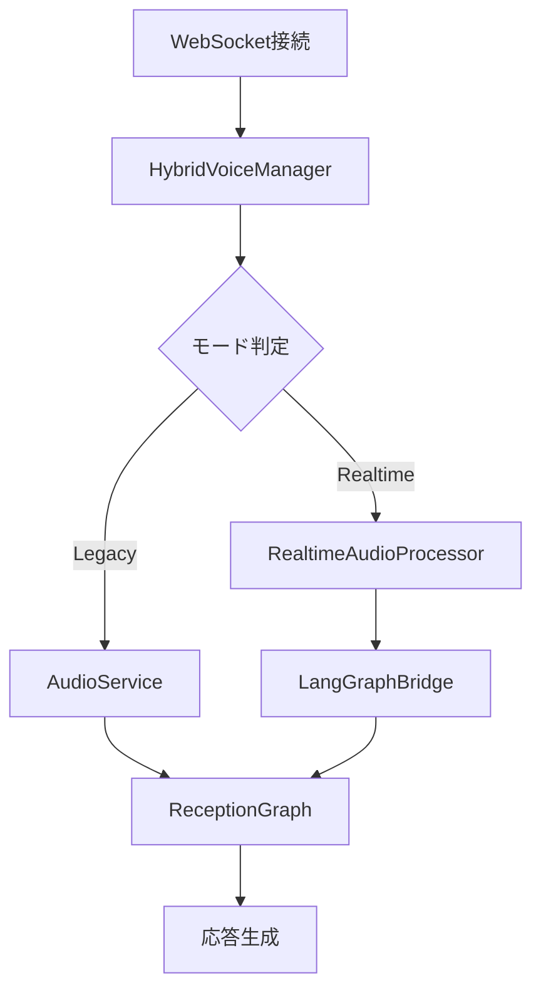

# OpenAI Realtime API統合実装ガイド

## 概要

このドキュメントは、ai-receptionシステムへのOpenAI Realtime API段階的ハイブリッド統合の実装ガイドです。

## アーキテクチャ概要

### ハイブリッド統合アプローチ



### コンポーネント構成

1. **HybridVoiceManager**: メイン統合管理
2. **RealtimeAudioProcessor**: Realtime API専用処理
3. **LangGraphBridge**: Function Calls統合
4. **SessionStore**: 拡張セッション管理
5. **MetricsCollector**: 使用量・パフォーマンス監視
6. **FallbackManager**: 自動フォールバック制御

## セットアップ手順

### 1. 環境設定

```bash
# 1. 環境変数設定
cp .env.realtime.template .env
# .env ファイルを編集してAPI キーを設定

# 2. 依存関係インストール
cd backend
pip install websockets aiosqlite

# 3. データベース初期化
sqlite3 data/ai_reception.db < migrations/add_realtime_support.sql
```

### 2. 段階的有効化

#### Phase 1: 基本統合（フィーチャーフラグOFF）
```bash
# Legacy モードのみで動作確認
FEATURE_REALTIME_MODE_ENABLED=false
```

#### Phase 2: 限定テスト（特定セッション）
```bash
# 特定セッションでのみRealtime有効化
FEATURE_REALTIME_MODE_ENABLED=true
FEATURE_REALTIME_ROLLOUT_PERCENTAGE=0
FEATURE_REALTIME_ALLOWLIST_SESSIONS="test_session_1,test_session_2"
```

#### Phase 3: 段階的ロールアウト
```bash
# 10%のセッションでRealtime有効化
FEATURE_REALTIME_ROLLOUT_PERCENTAGE=10
```

#### Phase 4: 全面展開
```bash
# 100%のセッションでRealtime有効化
FEATURE_REALTIME_ROLLOUT_PERCENTAGE=100
```

## 実装詳細

### WebSocket統合

既存の`/backend/app/api/websocket.py`が自動的にモード判定を行います：

```python
# モード判定
use_realtime = is_realtime_enabled(session_id)

if use_realtime:
    # Realtime API使用
    hybrid_result = await manager.hybrid_manager.process_audio_message(session_id, audio_chunk)
else:
    # Legacy処理
    transcribed_text = await manager.audio_service.process_audio_input(audio_chunk)
```

### Function Calls統合

LangGraphの既存ノードがFunction Callsとして呼び出されます：

```python
# Realtime APIからのFunction Call
{
    "name": "collect_visitor_info",
    "parameters": {
        "visitor_name": "山田太郎",
        "company_name": "株式会社テスト"
    }
}

# LangGraphBridgeがこれを既存ノードにマッピング
result = await nodes.collect_all_info_node(state)
```

### コスト監視

リアルタイムでコスト監視・制限を実行：

```python
# 1時間あたりコスト制限
if await metrics_collector.get_hourly_cost() > settings.cost_limit_per_hour:
    await fallback_manager.trigger_fallback(session_id, FallbackReason.COST_LIMIT)
```

## テスト戦略

### 1. ユニットテスト

```bash
# 各コンポーネントのテスト
pytest tests/test_hybrid_voice_manager.py
pytest tests/test_realtime_processor.py
pytest tests/test_langgraph_bridge.py
```

### 2. 統合テスト

```bash
# エンドツーエンドテスト
pytest tests/test_realtime_integration.py
```

### 3. 負荷テスト

```bash
# 同時セッション負荷テスト
python tests/load_test_realtime.py --sessions 50 --duration 300
```

### 4. フォールバックテスト

```bash
# フォールバック機能テスト
python tests/test_fallback_scenarios.py
```

## 運用監視

### メトリクス監視

主要メトリクス：
- セッション数（Realtime/Legacy別）
- 平均レイテンシ
- 時間あたりコスト
- 成功率・エラー率
- フォールバック発生回数

### ダッシュボード

```python
# 現在の状況確認
GET /api/v1/realtime/status

# メトリクス取得
GET /api/v1/realtime/metrics

# フォールバック状態
GET /api/v1/realtime/fallback-status
```

### アラート設定

```bash
# コスト制限アラート
ALERT_COST_THRESHOLD=40.0  # $40/時間でアラート

# エラー率アラート  
ALERT_ERROR_RATE_THRESHOLD=0.1  # 10%エラー率でアラート
```

## 本番デプロイメント

### 段階的リリース手順

1. **準備段階**
   - 環境変数設定
   - データベースマイグレーション実行
   - 監視システム設定

2. **カナリアリリース**
   - 1%のトラフィックでRealtime有効化
   - 24時間監視

3. **段階的拡大**
   - 問題なければ10% → 50% → 100%と段階的拡大
   - 各段階で24-48時間の監視期間

4. **全面展開**
   - 全セッションでRealtime有効化
   - Legacy フォールバック維持

### ロールバック手順

緊急時のロールバック：

```bash
# 即座にLegacyモードに戻す
curl -X POST /api/v1/realtime/force-fallback \
  -H "Content-Type: application/json" \
  -d '{"reason": "emergency_rollback"}'

# または環境変数で無効化
FEATURE_REALTIME_MODE_ENABLED=false
```

## トラブルシューティング

### 一般的な問題と対処法

1. **Realtime API接続エラー**
   ```bash
   # ヘルスチェック実行
   curl /api/v1/realtime/health-check
   
   # ログ確認
   tail -f logs/realtime.log
   ```

2. **コスト超過**
   ```bash
   # 現在のコスト確認
   curl /api/v1/realtime/cost-status
   
   # 緊急停止
   curl -X POST /api/v1/realtime/emergency-stop
   ```

3. **レイテンシ問題**
   ```bash
   # パフォーマンス統計確認
   curl /api/v1/realtime/performance-stats
   ```

### ログレベル調整

```bash
# デバッグモード有効化
FEATURE_ENABLE_DEBUG_LOGGING=true
LOG_LEVEL=DEBUG

# 本番環境
LOG_LEVEL=INFO
REALTIME_ENABLE_DETAILED_LOGGING=false
```

## セキュリティ考慮事項

1. **API キー管理**
   - Realtime API キーは環境変数で管理
   - 定期的なローテーション

2. **音声データ処理**
   - 音声データのログ出力は無効化
   - 一時的なメモリ内処理のみ

3. **アクセス制御**
   - セッションベースの認証
   - レート制限実装

## パフォーマンス最適化

1. **接続プール**
   - WebSocket接続の効率的な管理
   - 接続の再利用

2. **キャッシュ戦略**
   - Function Call結果のキャッシュ
   - 音声合成結果のキャッシュ

3. **リソース管理**
   - メモリ使用量の監視
   - 不要なセッションのクリーンアップ

## 今後の拡張予定

1. **多言語対応**
   - 英語、中国語などの追加サポート

2. **カスタム音声モデル**
   - 企業固有の音声モデル統合

3. **アドバンス分析**
   - 会話品質の自動評価
   - ユーザー満足度指標

## サポート

問題や質問がある場合：

1. ログファイル確認: `logs/realtime.log`
2. メトリクス確認: `/api/v1/realtime/metrics`
3. ヘルスチェック: `/api/v1/realtime/health-check`

詳細なトラブルシューティングは開発チームにお問い合わせください。