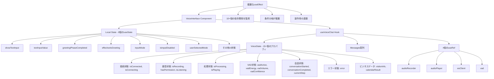
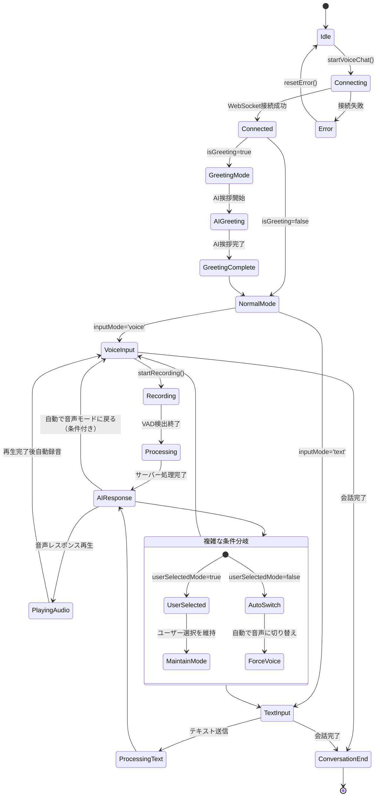
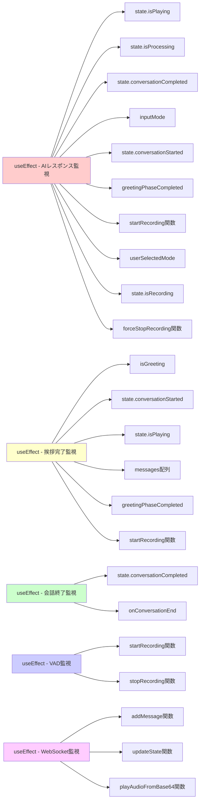

# フロントエンド状態管理の複雑性分析

## 概要

現在のフロントエンド（VoiceInterface.tsx + useVoiceChat.ts）の状態管理が複雑になっている要因と構造を分析します。

## 状態管理の構造

### 1. VoiceInterface.tsx内の状態
```typescript
// 基本的な表示状態
const [showTextInput, setShowTextInput] = useState(false);
const [textInputValue, setTextInputValue] = useState('');

// 挨拶フェーズ管理
const [greetingPhaseCompleted, setGreetingPhaseCompleted] = useState(false);
const [effectiveIsGreeting, setEffectiveIsGreeting] = useState(isGreeting);

// 入力モード管理
const [inputMode, setInputMode] = useState<'voice' | 'text'>('voice');
const [isInputDisabled, setIsInputDisabled] = useState(false);
const [userSelectedMode, setUserSelectedMode] = useState(false);
```

### 2. useVoiceChat.ts内のVoiceState
```typescript
interface VoiceState {
  // 接続状態
  isConnected: boolean;
  isConnecting: boolean;
  
  // 録音状態
  isRecording: boolean;
  hasPermission: boolean;
  isListening: boolean;
  
  // 処理状態
  isProcessing: boolean;
  isPlaying: boolean;
  
  // VAD（音声活動検出）状態
  vadActive: boolean;
  vadEnergy: number;
  vadVolume: number;
  vadConfidence: number;
  
  // 会話状態
  conversationStarted: boolean;
  conversationCompleted: boolean;
  currentStep: string;
  
  // エラー処理
  error: string | null;
  
  // 訪問者情報
  visitorInfo?: any;
  calendarResult?: any;
}
```

## 複雑性の要因

### 1. **多層的な状態分散**
- **VoiceInterface.tsx**: UI固有の状態（8個の useState）
- **useVoiceChat.ts**: ビジネスロジック状態（VoiceStateで15+個のプロパティ）
- **メッセージ管理**: 別途配列で管理
- **Ref管理**: 4個のuseRefでサービスクラス保持

### 2. **複雑な状態同期**
VoiceInterface.tsxの複雑なuseEffect依存関係：
```typescript
// 67行目: AIの応答完了を監視してモード切替を制御
useEffect(() => {
  // 10個以上の状態を監視
}, [state.isPlaying, state.isProcessing, state.conversationCompleted, 
    inputMode, state.conversationStarted, greetingPhaseCompleted, 
    startRecording, userSelectedMode, state.isRecording, forceStopRecording]);
```

### 3. **条件分岐の複雑化**
```typescript
// 挨拶フェーズの判定
if (!userSelectedMode) {
  if (inputMode === 'text') {
    // 自動で音声モードに切り替え
    if (state.conversationStarted && greetingPhaseCompleted) {
      // 録音開始
    }
  } else if (inputMode === 'voice' && state.conversationStarted && greetingPhaseCompleted) {
    // 録音再開
  }
} else {
  // ユーザー選択モードの場合の処理
}
```

### 4. **非同期処理の連鎖**
```typescript
// useVoiceChat.ts内での複雑な非同期チェーン
playAudioFromBase64(message.audio).then(() => {
  console.log('🎬 Final audio playback completed');
  updateState({
    // 複数の状態を同時更新
    conversationCompleted: true,
    isProcessing: false
  });
}).catch((error) => {
  // エラーハンドリングでも状態更新
});
```

### 5. **モード管理の複雑性**
- **通常モード** vs **挨拶モード**
- **音声入力モード** vs **テキスト入力モード**  
- **ユーザー選択モード** vs **自動切り替えモード**
- **録音状態** vs **非録音状態**

各モードの組み合わせで動作が変わるため、条件分岐が爆発的に増加。

## 具体的な問題点

### 1. **状態の重複と整合性問題**
- `effectiveIsGreeting` と `isGreeting` の使い分け
- `inputMode` と `showTextInput` の同期
- `greetingPhaseCompleted` と `state.conversationStarted` の関係

### 2. **予期しない状態遷移**
- AI応答中のモード切り替え禁止
- 挨拶完了後の自動録音開始
- ユーザー選択フラグのリセットタイミング

### 3. **デバッグの困難さ**
- 大量のconsole.logによる状態追跡
- 複雑な条件分岐でのバグ発生箇所の特定困難
- 非同期処理とuseEffectの競合状態

### 4. **テスト可能性の低下**
- 複数の外部サービス依存（AudioRecorder, WebSocket, VAD）
- useEffectの副作用が多く、単体テストが困難
- モックの複雑化

## 改善提案

### 1. **状態管理の統合**
- Redux ToolkitやZustandを使った単一ストア
- 状態の正規化とアクションベースの更新

### 2. **ステートマシンの導入**
- XStateを使った明確な状態遷移定義
- モードとフェーズの組み合わせを状態として明示

### 3. **責務の分離**
```typescript
// 提案構造
- useVoiceConnection (接続管理)
- useVoiceRecording (録音管理)  
- useVoicePlayback (再生管理)
- useConversationState (会話状態)
- useInputMode (入力モード管理)
```

### 4. **カスタムフックの細分化**
複雑なuseEffectを小さなカスタムフックに分割し、単一責務にする。

### 5. **型安全性の向上**
```typescript
type ConversationPhase = 'idle' | 'greeting' | 'active' | 'completed';
type InputMode = 'voice' | 'text';
type VoiceState = 'idle' | 'recording' | 'processing' | 'playing';
```

明確な型定義により、不正な状態遷移を防ぐ。

## 状態管理の可視化

### 1. 現在の状態構造図



### 2. 状態遷移の複雑性



### 3. useEffect依存関係の複雑性



### 4. 理想的な状態管理構造（提案）

```mermaid
graph TD
    A[Single Store - Redux/Zustand] --> B[Connection Slice]
    A --> C[Recording Slice]
    A --> D[Playback Slice]
    A --> E[Conversation Slice]
    A --> F[UI Slice]
    
    B --> B1[connectionState: 'idle' | 'connecting' | 'connected' | 'error']
    B --> B2[error: string | null]
    
    C --> C1[recordingState: 'idle' | 'recording' | 'processing']
    C --> C2[vadData: VADResult]
    C --> C3[hasPermission: boolean]
    
    D --> D1[playbackState: 'idle' | 'playing']
    D --> D2[audioQueue: AudioData[]]
    
    E --> E1[phase: 'idle' | 'greeting' | 'active' | 'completed']
    E --> E2[messages: Message[]]
    E --> E3[visitorInfo: VisitorData | null]
    
    F --> F1[inputMode: 'voice' | 'text']
    F --> F2[showTextInput: boolean]
    F --> F3[textInputValue: string]
    
    G[State Machine] --> A
    G --> G1[明確な状態遷移]
    G --> G2[不正な遷移の防止]
    G --> G3[副作用の最小化]
    
    H[Custom Hooks] --> H1[useConnection]
    H --> H2[useRecording]
    H --> H3[usePlayback]
    H --> H4[useConversation]
    H --> H5[useUI]
    
    H1 --> B
    H2 --> C
    H3 --> D
    H4 --> E
    H5 --> F
```

## 結論

現在の状態管理は機能的には動作しているものの、以下の問題を抱えています：

1. **高い複雑性**: 多層的な状態分散と複雑な同期処理
2. **保守性の低下**: 状態変更の影響範囲が予測困難
3. **拡張性の問題**: 新機能追加時の既存機能への影響リスク
4. **テスト困難性**: 複雑な状態遷移とモック要件

リファクタリングにより、より保守しやすく拡張しやすい構造に変更することを推奨します。