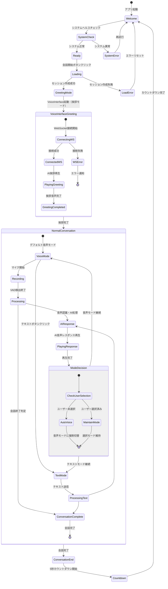
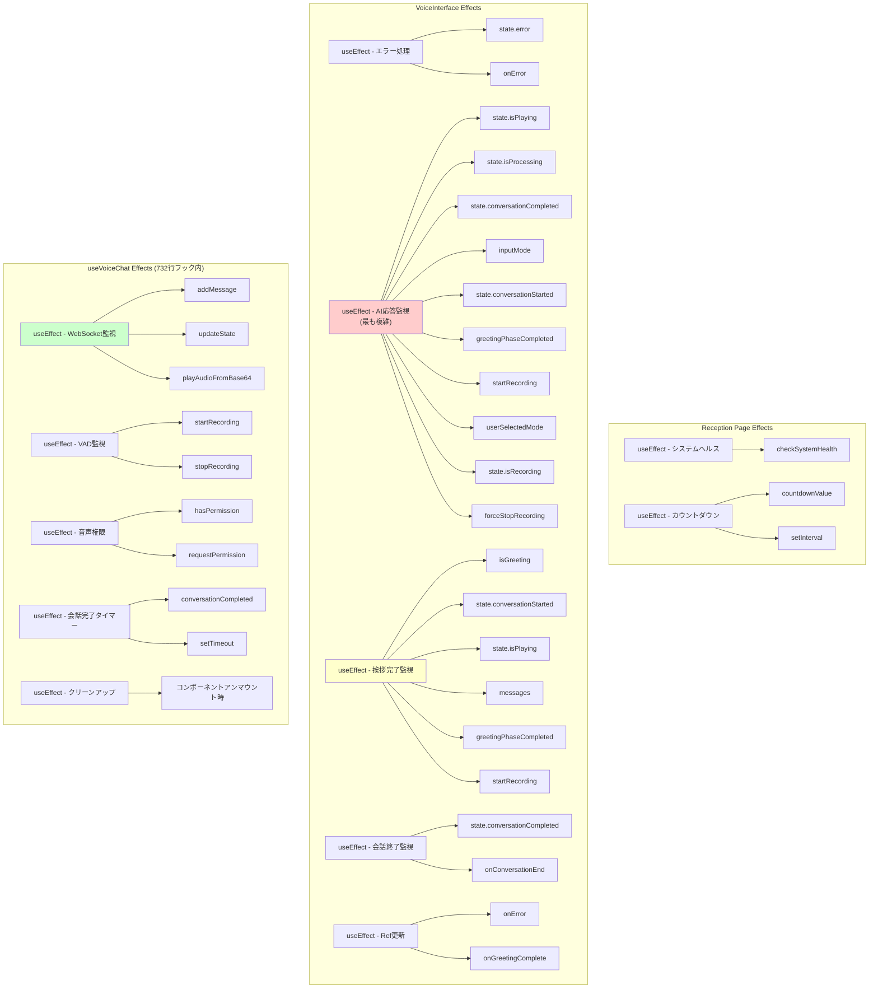
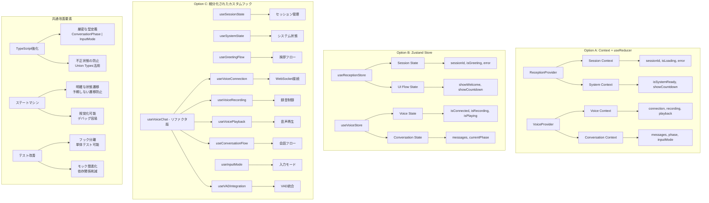

# フロントエンド状態管理の複雑性分析

## 概要

現在のフロントエンド（VoiceInterface.tsx + useVoiceChat.ts + Reception Page）の状態管理構造と特徴を分析します。Next.js 15 App Routerベースのタブレット向けキオスクアプリケーションです。

## 現在のアーキテクチャ構造

### 技術スタック
- **フレームワーク**: Next.js 15 (App Router)
- **言語**: TypeScript + React 18
- **スタイリング**: Tailwind CSS 3
- **状態管理**: React useState + カスタムフック
- **音声処理**: Web API (MediaRecorder, AudioContext, VAD)
- **通信**: WebSocket + REST API

### ディレクトリ構造
```
frontend/
├── app/                  # Next.js App Router
│   ├── layout.tsx       # タブレット最適化レイアウト
│   ├── page.tsx         # ランディングページ
│   └── reception/
│       └── page.tsx     # メイン受付インターフェース
├── components/          # コンポーネント群
│   ├── VoiceInterface.tsx        # 音声対話メインコンポーネント
│   ├── VolumeReactiveMic.tsx     # マイク視覚フィードバック
│   ├── SimpleMessageDisplay.tsx  # メッセージ表示
│   ├── ReceptionButton.tsx       # スタート用ボタン
│   ├── ChatInterface.tsx         # テキストチャット(レガシー)
│   └── ConversationDisplay.tsx   # 会話履歴(未使用)
├── hooks/               # カスタムフック
│   └── useVoiceChat.ts  # 音声チャット状態管理(732行)
├── lib/                 # コアライブラリ
│   ├── websocket.ts     # WebSocket通信
│   ├── audio-recorder.ts # 音声録音・再生
│   ├── vad.ts          # 音声活動検出
│   ├── api.ts          # REST API通信
│   └── types.ts        # 型定義
```

## 状態管理の構造

### 1. Reception Page State（/app/reception/page.tsx）
```typescript
// セッション管理
const [sessionId, setSessionId] = useState<string | null>(null);
const [isLoading, setIsLoading] = useState(false);
const [error, setError] = useState<string | null>(null);

// システム状態
const [isSystemReady, setIsSystemReady] = useState(false);
const [showWelcome, setShowWelcome] = useState(true);

// カウントダウン機能
const [showCountdown, setShowCountdown] = useState(false);
const [countdownValue, setCountdownValue] = useState(5);

// 挨拶モード
const [isGreeting, setIsGreeting] = useState(false);
```

### 2. VoiceInterface Component State
```typescript
// UI状態
const [showTextInput, setShowTextInput] = useState(false);
const [textInputValue, setTextInputValue] = useState('');

// 挨拶フェーズ管理
const [greetingPhaseCompleted, setGreetingPhaseCompleted] = useState(false);
const [effectiveIsGreeting, setEffectiveIsGreeting] = useState(isGreeting);

// 入力モード管理（音声/テキスト）
const [inputMode, setInputMode] = useState<'voice' | 'text'>('voice');
const [isInputDisabled, setIsInputDisabled] = useState(false);
const [userSelectedMode, setUserSelectedMode] = useState(false);
```

### 3. useVoiceChat Hook State（732行の巨大フック）
```typescript
interface VoiceState {
  // 接続状態
  isConnected: boolean;
  isConnecting: boolean;
  
  // 録音状態
  isRecording: boolean;
  hasPermission: boolean;
  isListening: boolean; // VAD監視状態
  
  // 処理状態
  isProcessing: boolean;
  isPlaying: boolean;
  
  // VAD（音声活動検出）状態
  vadActive: boolean;
  vadEnergy: number;
  vadVolume: number;
  vadConfidence: number;
  
  // 会話状態
  conversationStarted: boolean;
  conversationCompleted: boolean;
  currentStep: string;
  
  // エラー処理
  error: string | null;
  
  // ビジネスデータ
  visitorInfo?: any;
  calendarResult?: any;
}

// メッセージ管理（別途管理）
export interface ConversationMessage {
  speaker: 'visitor' | 'ai';
  content: string;
  timestamp: string;
  audioData?: string; // AI応答用base64音声データ
}

// サービスクラス（useRefで管理）
- audioRecorder: AudioRecorder
- audioPlayer: AudioPlayer
- wsClient: VoiceWebSocketClient
- vad: ClientVoiceActivityDetector
```

### 4. コアライブラリサービス
```typescript
// WebSocket Client (/lib/websocket.ts)
- リアルタイム双方向通信
- メッセージタイプ処理（voice_response, transcription, vad_status等）
- 自動再接続・ハートビート

// Audio Recorder/Player (/lib/audio-recorder.ts)
- MediaRecorder API統合
- リアルタイム音声チャンク処理
- 音声再生管理

// Voice Activity Detection (/lib/vad.ts)
- クライアントサイド音声解析
- リアルタイムエネルギー・ボリューム計算
- 発話検出・視覚フィードバック

// API Client (/lib/api.ts)
- REST API通信（HTTP）
- リトライロジック・エラーハンドリング
```

## アーキテクチャ特徴と複雑性

### 1. **多層的な状態分散**
- **Reception Page**: セッション・システム状態（7個のuseState）
- **VoiceInterface**: UI・入力モード状態（7個のuseState）
- **useVoiceChat Hook**: ビジネスロジック状態（15+個のプロパティ）
- **メッセージ管理**: 別途ConversationMessage配列で管理
- **サービスRef**: 4個のuseRefでサービスクラス保持（WebSocket, Audio, VAD等）

### 2. **複雑な状態同期とuseEffect依存関係**

#### Reception PageとVoiceInterfaceの状態同期
- Reception PageがセッションIDとisGreetingを管理
- VoiceInterfaceが詳細なUI状態とフロー制御
- プロップドリリングによる状態受け渡し

#### VoiceInterfaceの複雑なuseEffect
```typescript
// AI応答完了監視とモード切替制御（65行目）
useEffect(() => {
  // 複雑な条件分岐でモード自動切替
  if (!userSelectedMode) {
    // 自動モード: テキスト→音声への強制切替
  } else {
    // ユーザー選択モード: 選択を維持
  }
}, [state.isPlaying, state.isProcessing, state.conversationCompleted, 
    inputMode, state.conversationStarted, greetingPhaseCompleted, 
    startRecording, userSelectedMode, state.isRecording, forceStopRecording]);

// 挨拶完了監視（130行目）
useEffect(() => {
  // 挨拶フェーズから通常フェーズへの遷移制御
}, [isGreeting, state.conversationStarted, state.isPlaying, messages, 
    greetingPhaseCompleted, startRecording]);
```

### 3. **条件分岐の複雑化**
```typescript
// 入力モード制御の複雑な条件分岐
if (!userSelectedMode) {
  // 自動切替モード
  if (inputMode === 'text') {
    // AI応答後に自動で音声モードに切り替え
    setInputMode('voice');
    if (state.conversationStarted && greetingPhaseCompleted) {
      setTimeout(() => startRecording(), 500);
    }
  } else if (inputMode === 'voice' && state.conversationStarted && greetingPhaseCompleted) {
    // 音声モードでの録音再開
    setTimeout(() => startRecording(), 500);
  }
} else {
  // ユーザー選択モード: 選択したモードを維持
  if (inputMode === 'voice' && state.conversationStarted && greetingPhaseCompleted) {
    setTimeout(() => startRecording(), 500);
  }
}

// Reception Pageでの複雑なフロー制御
if (showWelcome) {
  // ウェルカム画面表示
} else if (isLoading) {
  // ローディング表示
} else if (sessionId && !showCountdown) {
  // 音声インターフェース表示
} else if (showCountdown) {
  // カウントダウン表示
}
```

### 4. **非同期処理の連鎖**
```typescript
// Reception Pageでの非同期フロー
const handleStartConversation = async () => {
  setShowWelcome(false);
  setIsLoading(true);
  
  try {
    const response = await apiClient.startConversation();
    setSessionId(response.session_id);
    setIsGreeting(true); // VoiceInterfaceに挨拶モードを指示
  } catch (error) {
    setError(error.message);
    setShowWelcome(true); // エラー時は元に戻す
  } finally {
    setIsLoading(false);
  }
};

// useVoiceChat内での複雑な非同期チェーン
const handleVoiceResponse = async (message: WSVoiceMessage) => {
  if (message.audio) {
    try {
      await playAudioFromBase64(message.audio);
      console.log('🎬 Audio playback completed');
      updateState({
        conversationCompleted: true,
        isProcessing: false,
        isPlaying: false
      });
      
      // 5秒後に会話終了処理を実行
      setTimeout(() => {
        if (onConversationEndRef.current) {
          onConversationEndRef.current();
        }
      }, 5000);
    } catch (error) {
      console.error('Audio playback failed:', error);
      updateState({ error: 'Audio playback failed', isPlaying: false });
    }
  }
};
```

### 5. **多次元のモード管理**
#### アプリケーションフロー
- **ウェルカム画面** → **ロード中** → **音声インターフェース** → **カウントダウン** → **リセット**

#### 挨拶モード管理
- **挨拶モード** vs **通常モード** (Reception Pageで制御)
- **挨拶フェーズ完了** vs **未完了** (VoiceInterfaceで制御)
- **効果的挨拶状態** (effectiveIsGreeting)の複雑な管理

#### 入力モード管理
- **音声入力モード** vs **テキスト入力モード**
- **ユーザー選択モード** vs **自動切り替えモード**
- **入力無効化状態** (AI応答中の制御)

#### 音声状態管理
- **録音状態** vs **非録音状態**
- **処理中** vs **再生中** vs **待機中**
- **VAD有効** vs **無効**
- **音声許可** vs **未許可**

各モードの組み合わせ（4×3×3×4 = 144通りの状態）で動作が変わるため、条件分岐が爆発的に増加。

## 具体的な問題点

### 1. **状態の重複と整合性問題**
- `isGreeting` (Reception Page) と `effectiveIsGreeting` (VoiceInterface) の使い分け
- `greetingPhaseCompleted` と `state.conversationStarted` の関係性
- `inputMode` と `showTextInput` の同期
- `sessionId` の Reception Page から VoiceInterface への受け渡し
- `userSelectedMode` フラグのリセットタイミング

### 2. **予期しない状態遷移**
- AI応答中の入力モード切替禁止 (`isInputDisabled` での制御)
- 挨拶完了後の自動録音開始（遅延処理での競合）
- ユーザー選択フラグ (`userSelectedMode`) のリセットタイミング
- カウントダウンからリセットまでの複雑なフロー
- WebSocket接続失敗時の状態復帰

### 3. **デバッグの困難さ**
- 大量のconsole.logによる状態追跡 (useVoiceChat.tsで50+箇所)
- 複雑な条件分岐でのバグ発生箇所の特定困難
- 非同期処理とuseEffectの競合状態 (setTimeout遅延処理)
- 複数コンポーネント間の状態同期エラーの追跡困難
- 732行の巨大フック (`useVoiceChat`) のメンテナンス困難

### 4. **テスト可能性の低下**
- 複数の外部サービス依存（WebSocket, MediaRecorder, AudioContext, VAD）
- 巨大なカスタムフック (`useVoiceChat`) の単体テスト困難
- useEffectの副作用チェーンが多く、テスト時の状態制御困難
- タイムアウト処理 (`setTimeout`) による非決定的テスト
- モック要件の複雑化（Audio API, WebSocket, VAD等）

## 現在の構成の評価

### 長所
- **シンプルな技術スタック**: 外部状態管理ライブラリなし
- **タブレット最適化**: キオスクモード、タッチ対応の良いUX
- **リアルタイム音声処理**: WebSocket + VADの効果的な統合
- **デュアル入力モード**: 音声・テキスト両対応の柔軟性
- **Next.js App Router**: モダンなフレームワーク採用

### 改善が必要な領域
- **状態の分散**: 複数コンポーネントに散在した状態管理
- **巨大フック**: 732行のuseVoiceChatフック
- **複雑な条件分岐**: 多次元モード管理による爆発的増加
- **テスト困難性**: 大量のuseEffectと副作用

## 改善提案

### 1. **状態管理のリファクタリング選択肢**

#### Option A: Context API + useReducer
```typescript
// 現在のReact生態系内での改善
const ReceptionContext = createContext<ReceptionState>();
const VoiceContext = createContext<VoiceState>();

// 複雑なuseStateをuseReducerで置き換え
const [state, dispatch] = useReducer(voiceReducer, initialState);
```

#### Option B: Zustand導入
```typescript
// 軽量な外部状態管理
const useReceptionStore = create<ReceptionState>((set) => ({
  sessionId: null,
  isGreeting: false,
  setGreeting: (value) => set({ isGreeting: value })
}));
```

#### Option C: 現在のアプローチを改善
```typescript
// 既存のuseStateアプローチを細分化
const useSessionState = () => ({ sessionId, isLoading, error });
const useGreetingState = () => ({ isGreeting, greetingCompleted });
const useInputState = () => ({ inputMode, userSelected });
```

### 2. **useVoiceChatフックの分割**
```typescript
// 732行の巨大フックを責務別に分割
const useVoiceConnection = () => ({ isConnected, connect, disconnect });
const useVoiceRecording = () => ({ isRecording, startRecording, stopRecording });
const useVoicePlayback = () => ({ isPlaying, playAudio, stopAudio });
const useConversationFlow = () => ({ messages, conversationState });
const useVADIntegration = () => ({ vadActive, vadEnergy, vadVolume });

// メインフックで統合
const useVoiceChat = () => {
  const connection = useVoiceConnection();
  const recording = useVoiceRecording();
  const playback = useVoicePlayback();
  const conversation = useConversationFlow();
  const vad = useVADIntegration();
  
  return { connection, recording, playback, conversation, vad };
};
```

### 3. **ステートマシンの検討**
```typescript
// XStateまたは軽量なステートマシン
type ReceptionFlow = 
  | { state: 'welcome' }
  | { state: 'loading' }
  | { state: 'greeting', sessionId: string }
  | { state: 'conversation', sessionId: string }
  | { state: 'countdown', countdown: number }
  | { state: 'error', error: string };

type VoiceFlow =
  | { state: 'idle' }
  | { state: 'recording', mode: 'voice' }
  | { state: 'processing' }
  | { state: 'playing' }
  | { state: 'text_input', mode: 'text' };
```

### 4. **型安全性の向上**
```typescript
// 厳密な型定義で不正状態を防ぐ
type ConversationPhase = 'idle' | 'greeting' | 'active' | 'completed';
type InputMode = 'voice' | 'text';
type ConnectionState = 'disconnected' | 'connecting' | 'connected' | 'error';
type RecordingState = 'idle' | 'recording' | 'processing';
type PlaybackState = 'idle' | 'playing';

// 状態の組み合わせを制限
type ValidVoiceState = 
  | { phase: 'idle', connection: 'disconnected' }
  | { phase: 'greeting', connection: 'connected', inputMode: 'voice' }
  | { phase: 'active', connection: 'connected', inputMode: 'voice' | 'text' };
```

### 5. **テスト戦略の改善**
```typescript
// フック単体テスト用のテストユーティリティ
const renderVoiceHook = (props = {}) => {
  return renderHook(() => useVoiceChat(props), {
    wrapper: ({ children }) => (
      <MockWebSocketProvider>
        <MockAudioProvider>
          {children}
        </MockAudioProvider>
      </MockWebSocketProvider>
    )
  });
};

// 統合テスト用のページコンポーネントテスト
const renderReceptionPage = () => {
  return render(<ReceptionPage />, {
    wrapper: MockProviders
  });
};
```

## 状態管理の可視化

### 1. 現在の状態構造図（更新版）

```mermaid
graph TD
    A[Reception Page] --> A1[Session State - 7個のuseState]
    A --> A2[System State - isSystemReady]
    A --> A3[UI Flow State - showWelcome, showCountdown]
    
    A1 --> A1a[sessionId]
    A1 --> A1b[isLoading]
    A1 --> A1c[error]
    A1 --> A1d[isGreeting]
    A1 --> A1e[showCountdown]
    A1 --> A1f[countdownValue]
    
    B[VoiceInterface Component] --> B1[Local State - 7個のuseState]
    B --> B2[useVoiceChat Hook - 732行]
    
    B1 --> B1a[showTextInput]
    B1 --> B1b[textInputValue]
    B1 --> B1c[greetingPhaseCompleted]
    B1 --> B1d[effectiveIsGreeting]
    B1 --> B1e[inputMode]
    B1 --> B1f[isInputDisabled]
    B1 --> B1g[userSelectedMode]
    
    B2 --> C[VoiceState - 15+個のプロパティ]
    B2 --> D[Messages配列]
    B2 --> E[4個のuseRef - サービスクラス]
    B2 --> F[複雑なuseEffect群]
    
    C --> C1[接続: isConnected, isConnecting]
    C --> C2[録音: isRecording, hasPermission, isListening]
    C --> C3[処理: isProcessing, isPlaying]
    C --> C4[VAD: vadActive, vadEnergy, vadVolume, vadConfidence]
    C --> C5[会話: conversationStarted, conversationCompleted]
    C --> C6[エラー: error]
    C --> C7[データ: visitorInfo, calendarResult]
    
    E --> E1[audioRecorder: AudioRecorder]
    E --> E2[audioPlayer: AudioPlayer]
    E --> E3[wsClient: VoiceWebSocketClient]
    E --> E4[vad: ClientVoiceActivityDetector]
    
    F --> F1[AI応答監視 - 10+依存関係]
    F --> F2[挨拶完了監視 - 6依存関係]
    F --> F3[会話終了監視]
    F --> F4[VAD監視]
    F --> F5[WebSocket監視]
    
    G[Core Libraries] --> G1[WebSocket Client - リアルタイム通信]
    G --> G2[Audio Recorder/Player - 音声処理]
    G --> G3[VAD - 音声活動検出]
    G --> G4[API Client - REST通信]
    
    H[Props Flow] --> A
    H --> B
    H --> H1[sessionId: A → B]
    H --> H2[isGreeting: A → B]
    H --> H3[onConversationEnd: B → A]
    H --> H4[onError: B → A]
```



### 2. アプリケーション全体の状態遷移



### 3. 現在のuseEffect依存関係の複雑性



### 4. 改善された状態管理構造（提案）



## 現在のアーキテクチャの総合評価

### 現在の状況
現在のフロントエンドは**Next.js 15 + TypeScript**で構築されたタブレット向けキオスクアプリケーションです。音声とテキストのデュアル入力に対応し、リアルタイムな音声処理とVAD統合により、自然な受付体験を提供しています。

### 機能的強み
1. **タブレット最適化**: キオスクモード、大きなタッチターゲット、直感的UI
2. **リアルタイム音声処理**: WebSocket + VADによる即座のフィードバック
3. **柔軟な入力モード**: 音声・テキスト両対応、自動切り替え機能
4. **堅牢なエラー処理**: システムヘルスチェック、接続失敗時の復旧
5. **モダンな技術スタック**: Next.js App Router、TypeScript、Tailwind CSS

### 技術的課題
1. **状態管理の分散**: Reception Page + VoiceInterface + useVoiceChat（732行）に分散
2. **複雑な状態同期**: 多次元モード管理（フロー×挨拶×入力×音声 = 144通り）
3. **useEffect依存関係**: AI応答監視で10+の依存関係、予期しない副作用
4. **テスト困難性**: 巨大フック、複数のWeb API依存、非同期処理チェーン
5. **デバッグ困難**: 50+のconsole.log、複雑な条件分岐

### 推奨改善アプローチ

#### 短期的改善（現在のアーキテクチャを維持）
1. **useVoiceChatフックの分割** - 732行を責務別に分離
2. **型安全性の向上** - Union Typesで不正状態を防止
3. **useEffect整理** - 依存関係を最小化、単一責務に
4. **テストユーティリティ追加** - モック作成、フック単体テスト

#### 中期的改善（状態管理リファクタリング）
1. **Context API + useReducer** - React生態系内での改善
2. **Zustand導入** - 軽量な外部状態管理
3. **ステートマシンの部分導入** - 複雑なフローの明確化

#### 長期的改善（アーキテクチャ刷新）
1. **マイクロフロントエンド検討** - 機能別の完全分離
2. **フルステートマシン** - XStateによる全体設計
3. **パフォーマンス最適化** - レンダリング最適化、メモ化

### 結論
現在のアーキテクチャは**機能要件を満たし、ユーザー体験も良好**ですが、**開発者体験とメンテナンス性に課題**があります。既存の投資を活かしつつ、段階的な改善を推奨します。

最優先は**useVoiceChatフックの分割**と**型安全性向上**です。これにより、コードの理解しやすさとテスト可能性が大幅に向上し、今後の機能拡張がより安全に行えるようになります。